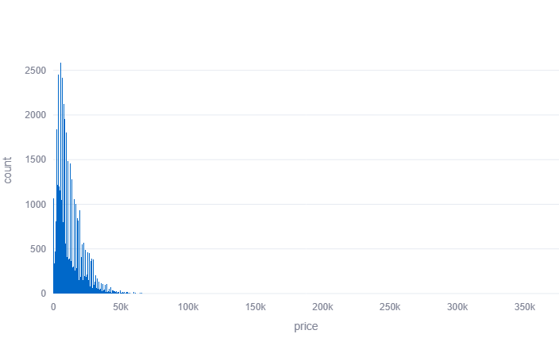

Proyecto: Análisis de Datos de Vehículos

Descripción

Aplicación web desarrollada en Python usando Streamlit que permite visualizar y analizar datos de anuncios de vehículos usados.
El usuario puede ver un histograma de precios y un gráfico de dispersión entre precio y año de los vehículos.

Tecnologías utilizadas

	•	Python 3
	•	Pandas
	•	Plotly Express
	•	Streamlit
	•	Git & GitHub
	•	Render.com (para el despliegue)

Cómo ejecutar el proyecto localmente

	1.	Clona este repositorio.
	2.	Crea y activa un entorno virtual.
	3.	Instala las dependencias:

pip install -r requirements.txt

	4.	Ejecuta la aplicación:

streamlit run app.py

Enlace a la aplicación desplegada

https://proyecto-vehiculos-vyx1.onrender.com/

## Captura de pantalla

